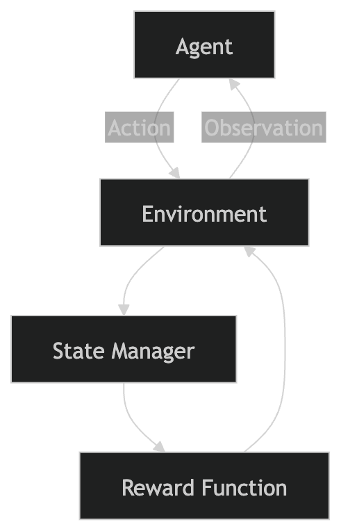

# Cloud Cost Optimizer Environment (OpenEnv)


## Overview & Motivation
Cloud computing waste is a multi-billion dollar problem. Organizations frequently incur unnecessary costs due to idle infrastructure, over-provisioned services, and lack of continuous auditing.

The Cloud Cost Optimizer Environment is a structured simulation designed to train LLM agents as autonomous FinOps (Financial Operations) Engineers. The agent interacts with a simulated cloud dashboard and must evaluate each server instance, choosing whether to `keep`, `downsize`, or `terminate` based on utilization and system role.

This environment adheres to the Meta PyTorch OpenEnv specification, providing:
- Deterministic evaluation
- Structured state/action/observation spaces
- Incremental reward signals
- Multi-level task complexity

## Why This is a Reinforcement Learning Problem
Cloud optimization is a sequential decision-making problem under constraints:
- Actions influence future system states and operational risk
- Incorrect decisions may cause delayed or catastrophic failures
- The agent must balance cost reduction, system reliability, and risk

This makes the environment suitable for:
- Reinforcement Learning (RL)
- Policy optimization
- Risk-sensitive decision systems

## Functional Requirements Met (Round 1 Checklist)
- Real-world task simulation (cloud infrastructure management)
- OpenEnv specification compliance with typed models
- Three difficulty levels: easy, medium, hard
- Deterministic reward and grading logic
- Baseline inference script using OpenAI via Hugging Face Router

## Environment Spaces

### Observation Space
```json
{
  "active_servers": [
    {"id": "srv-01", "role": "production_database", "cpu_usage": "85%"},
    {"id": "srv-02", "role": "old_backup", "cpu_usage": "0%"}
  ],
  "feedback": "Dashboard loaded. Please process servers."
}
```
### Action Space
```json
{
  "action_type": "terminate",
  "server_id": "srv-02"
}
```
### Allowed actions:

- keep
- downsize
- terminate

### State Space
- difficulty: Scenario complexity level
- total_servers: Initial number of servers
- servers_processed: Count of evaluated servers
- mistakes_made: Number of incorrect decisions

## Environment Dynamics
After each action:
- The selected server is marked as processed
- Feedback is generated based on correctness and risk level
- servers_processed += 1
- mistakes_made += 1 (if incorrect)

Episode ends when:
- All servers are processed, or
- A critical failure occurs

## Environment Dynamics
After each action:
- The selected server is marked as processed
- Feedback is generated based on correctness and risk level
- servers_processed += 1
- mistakes_made += 1 (if incorrect)

Episode ends when:
- All servers are processed, or
- A critical failure occurs

## Task Descriptions & Difficulty Levels

### Easy
- One abandoned test server (0% CPU)
- Expected action: terminate

### Medium
- Three servers:
  - High-load production server → keep
  - Oversized cache → downsize
  - Idle backup → terminate

### Hard
- Five servers with interdependent roles
- Includes critical services:
  - payment_gateway
  - main_website

Constraint:
- Terminating critical services results in immediate failure

## Reward Function & Grading Criteria

| Scenario | Reward |
|----------|--------|
| Correct action | +1.0 |
| Suboptimal but safe | +0.3 |
| Inefficient decision | -0.2 |
| High-risk mistake | -0.5 |
| Catastrophic failure | Episode termination |

This reward design encourages:
- Precision in decision-making
- Risk-aware policies
- Avoidance of destructive actions


## System Architecture



## Setup and Usage Instructions

### Prerequisites
- Python 3.10+
- uv package manager
- Hugging Face account and access token

### Installation
```bash
uv venv
source .venv/bin/activate  # Windows: .venv\Scripts\activate
uv pip install openenv-core pydantic openai python-dotenv
```

Set Environment Variable
```bash
export HF_TOKEN="hf_your_token_here"  # Windows: set HF_TOKEN=...
Run Baseline
uv run inference.py
```

Outputs:
- [START]
- [STEP]
- [END]

---

## Baseline Performance Scores

| Model | Easy | Medium | Hard | Avg Steps |
|------|------|--------|------|----------|
| gpt-4o-mini | True | True | True | 3.0 |
| Qwen2.5-Coder-32B | True | True | False | 4.2 |

---

## Baseline Analysis

- gpt-4o-mini succeeds due to strong contextual reasoning and risk awareness  
- Qwen2.5-Coder-32B fails in Hard mode due to:
  - Over-aggressive optimization  
  - Poor identification of critical infrastructure  

**Insight:**  
The environment distinguishes between rule-based agents and context-aware decision-makers, validating its usefulness for training FinOps AI systems.

---

## Future Work

- Introduce cost budgets and constraints  
- Model inter-service dependencies  
- Add SLA, latency, and uptime considerations  
- Enable multi-step planning scenarios  
- Train RL agents using PPO and DQN variants  
- Expand into a FinOps benchmarking suite
---
